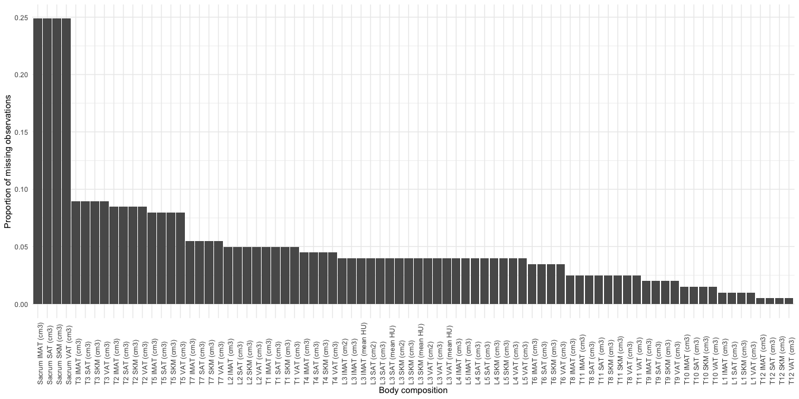

Statistical Analysis Plan
================
Hyejung Lee <hyejung.lee@utah.edu>
Thu Mar 27, 2025 13:14:08

- [Introduction](#introduction)
- [Research Objectives](#sec-RO)
- [Data](#data)
  - [Data quality](#data-quality)
  - [Baseline body composition](#baseline-body-composition)
  - [Outcome](#outcome)
  - [Confounder](#confounder)
  - [Cohort selection](#cohort-selection)
  - [Missing values](#missing-values)
- [Statistical methods](#statistical-methods)
  - [Missing values](#missing-values-1)
  - [Simple Models](#simple-models)
  - [Longtiduinal body composition](#sec-LMER)
  - [Survival model](#sec-survival)
  - [Joint Models](#joint-models)
  - [Detailed explanation of Joint
    model](#detailed-explanation-of-joint-model)
    - [Survival submodel](#survival-submodel)
    - [Longitudinal Submodel](#longitudinal-submodel)
    - [Monte Carlo Estimation Maximization (MCEM) method with Antithetic
      Sampling](#monte-carlo-estimation-maximization-mcem-method-with-antithetic-sampling)
      - [Model Setup](#model-setup)
        - [Longitudinal Model](#longitudinal-model)
        - [Survival Model](#survival-model)
      - [Expectation (E-Step)](#expectation-e-step)
      - [Complete-Data Log-Likelihood](#complete-data-log-likelihood)
      - [Antithetic Monte Carlo
        Sampling](#antithetic-monte-carlo-sampling)
      - [Maximization (M-Step)](#maximization-m-step)
      - [Summary](#summary)
  - [SAS-Style Convergence (convCrit =
    “sas”)](#sas-style-convergence-convcrit--sas)
    - [Parameter Stability Stopping
      Rule](#parameter-stability-stopping-rule)
    - [SAS-Style Convergence](#sas-style-convergence)
    - [Maximum Iteration Stopping](#maximum-iteration-stopping)
    - [Summary](#summary-1)
  - [Monitoring $cv(\Delta^{(m+1)}_{rel})$](#monitoring-cvdeltam1_rel)
    - [Why Antithetic Sampling Helps](#why-antithetic-sampling-helps)
  - [Checking Convergence in R](#checking-convergence-in-r)

This SAP is made after I started working with Ann. To help me finish the
project.

  

# Introduction

Body compositions have been identified to be associated with survival of
metastatic non-small cell lung cancer (mNSCLC) patients. Recent evidence
suggests that body composition variables (e.g., skeletal muscle mass and
fat mass) may serve as independent prognostic factors of overall
survival in varying cancer types and stages, including metastatic lung
cancer. Work from our group reveals a 63% (0.37 HR, 95%CI 0.16, 0.87)
and 43% (0.57 HR, 95%CI 0.35, 0.93) reduction in mortality risk with
greater muscle and fat mass, respectively, at time of mNSCLC diagnosis.

The purpose of the present investigation is to evaluate the relationship
between body composition, as measured with the new DAFS software, at
diagnosis and changes throughout treatment, and overall survival among
mNSCLC patients, by utilizing serial CT scans from a convenience sample
of newly diagnosed mNSCLC patients.

  

# Research Objectives

1.  Model the changes in body composition from diagnosis over the course
    of 1 year for mNSCLC.
2.  Determine the relationship between body composition from diagnosis
    over the course of 1 year (over the first year of treatment), and
    overall survival for mNSCLC.

  

# Data

<div id="fig-spinal_cord"
style="float: left; margin: 5px; width: 350px;"
fig-cap="Spinal cord location and names.">


</div>

Data were collected from newly diagnosed mNCLC patients (N=71) at the
Huntsman Cancer Institute between YYYY/MM/DD to YYYY/MM/DD. This
observational study utilized standard-of-care CT scans capturing images
from the chest to abdomen (from T1, T2,…, to Sacrum;
see<sup>**fig-spinal_cord?**</sup>), which were analyzed using DAFS’s
automated imaging analysis. Our analysis focus on the four **types** of
body compositions: intramuscular adipose tissue, subcutaneous adipose
tissue, visceral adipose tissue, and skeletal muscle. A representative
CT scan illustrating L3 cross-section of these four types is shown
in<sup>**fig-CT_scan_types?**</sup>. For convenience, the spinal cord
locations T1, T2,…, to sacrum will be referred to as **locations**.

<div id="fig-CT_scan_types"
style="float: right; margin: 5px; width: 350px;"
fig-cap="Spinal cord location and names.">


</div>

Patients’ CT scans, obtained from the date of metastatic diagnosis up to
one year, were analyzed. Among many body compositions analyzed by DAFS,
we selected L3 location that were used in our previous study. Hereafter,
these 12 measures are referred to as original **body compositions** for
convenience. They include:

- IMAT (cm2) : Intramuscular adipose tissue area
- IMAT (cm3) : Intramuscular adipose tissue volume
- IMAT (mean HU) : Intramuscular adipose tissue density
- SAT (cm2) : Subcutaneous adipose tissue area
- SAT (cm3) : Subcutaneous adipose tissue volume
- SAT (mean HU) : Subcutaneous adipose tissue density
- SKM (cm2) : Skeletal muscle area
- SKM (cm3) : Skeletal muscle volume
- SKM (mean HU) : Skeletal muscle density
- VAT (cm2) : Visceral adipose tissue area
- VAT (cm3) : Visceral adipose tissue volume
- VAT (mean HU) : Visceral adipose tissue density

Additionally, we introduced 4 new body compositions which were made
available by the DAFS analysis.:

- IMAT whole body (cm3) : sum of all IMAT (cm3) values from locations T1
  to Sacrum
- SAT whole body (cm3) : sum of all SAT (cm3) values from locations T1
  to Sacrum
- SKM whole body (cm3) : sum of all SKM (cm3) values from locations T1
  to Sacrum
- VAT whole body (cm3) : sum of all VAT (cm3) values from locations T1
  to Sacrum

These composite variables represent the total volume $(cm^3)$ of each
body composition type in the midsection of the body and will be referred
to as **composite** body compositions. <span style="color:red;">We
decided to add these four composite body compositions in our study
because we believed that total volume of each type of body compositions
would be more strongly associated with survival than just a single
section of spinal cord. (check with Adriana. Is this right?)</span>

## Data quality

Initially, I was concerned that alot of chest scan values of VAT (cm3)
having zeros. I emailed Jeff and Adriana about this, and see if this is
expected value physiologically. I heard back from Jeff on Monday Feb 24,
2025, that this is expected. VAT should mostly be deposited around the
abdomen and pelvis. So I decided to generate VAT whole body (cm3) just
fine.

## Baseline body composition

As in our previous study, we defined baseline body composition to be
DAFS analysis of scans taken within -60 to +30 days of diagnosis date.

## Outcome

We have two outcome of interest, which are longitudinal body
compositions and survival. As noted in the beginning
of<sup>**sec-Data?**</sup>, there are 16 longitudinal body composition
outcomes, 12 original body compositions and 4 composite body
compositions.

## Confounder

<span style="color:red;">Adriana should provide why age, race/ethnicity,
and sex are confounding variable between body composition and time, and
between body composition and survival.</span>

Race/ethnicity was also identified as a confounder. However, the
majority were non-Hispanic White (41/48), while the remaining 7 patients
were missing information. Due to the overwhelming proportion of
non-Hispanic White patients and the lack of complete ethnicity data for
the remaining patients, the race/ethnicity variable was excluded from
modeling.

## Cohort selection

Below are exclusion criteria:

- N=71 -\> 65: Should have scans within 1 year of metastatic diagnosis
  and have scans after diagnosis Does not have any scans (6 patients did
  not meet this criteria)

- N=65 -\> 55: Have CT scans for abdomen that can be paired with chest
  scans. Pairing meaning that there are abdomen and chest scans within 1
  week of each other (10 patients did not meet this criteria)

- N=55 -\> 50: Have CT scan reading with at least 2 longitudinal
  measurements (5 patients did not meet this criteria. Four patients
  didn’t have any scans. One patient had only 1 scan.)

- N=50 -\>48: Due to data discrepancy, two patients were removed because
  the baseline scans did not fall within (-60, +30) days since
  metastatic diagnosis date.

Therefore, we have total 48 patients to analyze (equivalent to 201
observations).

## Missing values

Some body compositions are missing due to low quality of CT scans.
Handling of these missing values can be found in Statistical methods
section.

  

# Statistical methods

## Missing values

In this section, we explain the method of handling missing body
compositions.

<!-- For any given day, patient could have received either a whole body scan, or a separate CHEST and ABDOMEN scans. For the purposes of our study, we decided to pair the chest abdomen scan results as if they are taken on a same day if they are only 7 days apart. Our assumption here is that the body composition should not have drastically changed within 7 days. In this case, we fixed the date of scan to be when the chest scan was taken. From here and onward, we will say that chest and abdomen are taken on the same day. -->
<!-- The unit of observation is patient-date-scan. That is, if a patient got chest and abdomen scan on a same day, there are two rows for the patient, one for each scan. Suppose that the chest scan was meant to capture from T1 down to L3, and T11 down to L5 for the abdomen scan. There is an overlap of scanning areas from T11 to L3 between the chest and abdomen scans. These overlapping region was used to impute missing values. That is, suppose that the chest scan is missing values for T11 or T12 for some unknown reason. Then, these values can be imputed from the corresponding abdomen scan is these values are not missing from the abdomen scan. By doing so, we can capture the complete values for the chest scans from T1 through L3. This type of filling in the missing value is not what statisticians typically refer to as "imputation." We are filling in the missing values (missing from the machine readouts) of a scan with "true" values from another scan. -->

Some body compositions were missing due to failed imaging analysis of
the CT scans. However, the mechanism of failing is unknown. Thus, the
missing mechanism is missing completely at random (MCAR). To identify
how to handle the missing values, we decided to summarize the body
compositions with missing values.<sup>**tbl-missing_prop?**</sup> shows
percent missing (out of 201 scans) for each of 80 raw body composition,
in the order missing the most from top to bottom.

<figure>

<figcaption aria-hidden="true">Figure XX. Proportion of missing for each
body composition used for analysis. Note that the body compositions that
are generated by summing volume of each cross-section are not included
in this plot.</figcaption>
</figure>

<div style="border: 1px solid #ddd; padding: 0px; overflow-y: scroll; height:400px; ">

<table class="table" style="color: black; width: auto !important; margin-left: auto; margin-right: auto;">
<thead>
<tr>
<th style="text-align:left;position: sticky; top:0; background-color: #FFFFFF;">
Body Composition
</th>
<th style="text-align:left;position: sticky; top:0; background-color: #FFFFFF;">
N (%)
</th>
</tr>
</thead>
<tbody>
<tr>
<td style="text-align:left;">
Sacrum IMAT (cm3)
</td>
<td style="text-align:left;">
50 (24.88%)
</td>
</tr>
<tr>
<td style="text-align:left;">
Sacrum SAT (cm3)
</td>
<td style="text-align:left;">
50 (24.88%)
</td>
</tr>
<tr>
<td style="text-align:left;">
Sacrum SKM (cm3)
</td>
<td style="text-align:left;">
50 (24.88%)
</td>
</tr>
<tr>
<td style="text-align:left;">
Sacrum VAT (cm3)
</td>
<td style="text-align:left;">
50 (24.88%)
</td>
</tr>
<tr>
<td style="text-align:left;">
T3 IMAT (cm3)
</td>
<td style="text-align:left;">
18 (8.96%)
</td>
</tr>
<tr>
<td style="text-align:left;">
T3 SAT (cm3)
</td>
<td style="text-align:left;">
18 (8.96%)
</td>
</tr>
<tr>
<td style="text-align:left;">
T3 SKM (cm3)
</td>
<td style="text-align:left;">
18 (8.96%)
</td>
</tr>
<tr>
<td style="text-align:left;">
T3 VAT (cm3)
</td>
<td style="text-align:left;">
18 (8.96%)
</td>
</tr>
<tr>
<td style="text-align:left;">
T2 IMAT (cm3)
</td>
<td style="text-align:left;">
17 (8.46%)
</td>
</tr>
<tr>
<td style="text-align:left;">
T2 SAT (cm3)
</td>
<td style="text-align:left;">
17 (8.46%)
</td>
</tr>
<tr>
<td style="text-align:left;">
T2 SKM (cm3)
</td>
<td style="text-align:left;">
17 (8.46%)
</td>
</tr>
<tr>
<td style="text-align:left;">
T2 VAT (cm3)
</td>
<td style="text-align:left;">
17 (8.46%)
</td>
</tr>
<tr>
<td style="text-align:left;">
T5 IMAT (cm3)
</td>
<td style="text-align:left;">
16 (7.96%)
</td>
</tr>
<tr>
<td style="text-align:left;">
T5 SAT (cm3)
</td>
<td style="text-align:left;">
16 (7.96%)
</td>
</tr>
<tr>
<td style="text-align:left;">
T5 SKM (cm3)
</td>
<td style="text-align:left;">
16 (7.96%)
</td>
</tr>
<tr>
<td style="text-align:left;">
T5 VAT (cm3)
</td>
<td style="text-align:left;">
16 (7.96%)
</td>
</tr>
<tr>
<td style="text-align:left;">
T7 IMAT (cm3)
</td>
<td style="text-align:left;">
11 (5.47%)
</td>
</tr>
<tr>
<td style="text-align:left;">
T7 SAT (cm3)
</td>
<td style="text-align:left;">
11 (5.47%)
</td>
</tr>
<tr>
<td style="text-align:left;">
T7 SKM (cm3)
</td>
<td style="text-align:left;">
11 (5.47%)
</td>
</tr>
<tr>
<td style="text-align:left;">
T7 VAT (cm3)
</td>
<td style="text-align:left;">
11 (5.47%)
</td>
</tr>
<tr>
<td style="text-align:left;">
L2 IMAT (cm3)
</td>
<td style="text-align:left;">
10 (4.98%)
</td>
</tr>
<tr>
<td style="text-align:left;">
L2 SAT (cm3)
</td>
<td style="text-align:left;">
10 (4.98%)
</td>
</tr>
<tr>
<td style="text-align:left;">
L2 SKM (cm3)
</td>
<td style="text-align:left;">
10 (4.98%)
</td>
</tr>
<tr>
<td style="text-align:left;">
L2 VAT (cm3)
</td>
<td style="text-align:left;">
10 (4.98%)
</td>
</tr>
<tr>
<td style="text-align:left;">
T1 IMAT (cm3)
</td>
<td style="text-align:left;">
10 (4.98%)
</td>
</tr>
<tr>
<td style="text-align:left;">
T1 SAT (cm3)
</td>
<td style="text-align:left;">
10 (4.98%)
</td>
</tr>
<tr>
<td style="text-align:left;">
T1 SKM (cm3)
</td>
<td style="text-align:left;">
10 (4.98%)
</td>
</tr>
<tr>
<td style="text-align:left;">
T1 VAT (cm3)
</td>
<td style="text-align:left;">
10 (4.98%)
</td>
</tr>
<tr>
<td style="text-align:left;">
T4 IMAT (cm3)
</td>
<td style="text-align:left;">
9 (4.48%)
</td>
</tr>
<tr>
<td style="text-align:left;">
T4 SAT (cm3)
</td>
<td style="text-align:left;">
9 (4.48%)
</td>
</tr>
<tr>
<td style="text-align:left;">
T4 SKM (cm3)
</td>
<td style="text-align:left;">
9 (4.48%)
</td>
</tr>
<tr>
<td style="text-align:left;">
T4 VAT (cm3)
</td>
<td style="text-align:left;">
9 (4.48%)
</td>
</tr>
<tr>
<td style="text-align:left;">
L3 IMAT (cm2)
</td>
<td style="text-align:left;">
8 (3.98%)
</td>
</tr>
<tr>
<td style="text-align:left;">
L3 IMAT (cm3)
</td>
<td style="text-align:left;">
8 (3.98%)
</td>
</tr>
<tr>
<td style="text-align:left;">
L3 IMAT (mean HU)
</td>
<td style="text-align:left;">
8 (3.98%)
</td>
</tr>
<tr>
<td style="text-align:left;">
L3 SAT (cm2)
</td>
<td style="text-align:left;">
8 (3.98%)
</td>
</tr>
<tr>
<td style="text-align:left;">
L3 SAT (cm3)
</td>
<td style="text-align:left;">
8 (3.98%)
</td>
</tr>
<tr>
<td style="text-align:left;">
L3 SAT (mean HU)
</td>
<td style="text-align:left;">
8 (3.98%)
</td>
</tr>
<tr>
<td style="text-align:left;">
L3 SKM (cm2)
</td>
<td style="text-align:left;">
8 (3.98%)
</td>
</tr>
<tr>
<td style="text-align:left;">
L3 SKM (cm3)
</td>
<td style="text-align:left;">
8 (3.98%)
</td>
</tr>
<tr>
<td style="text-align:left;">
L3 SKM (mean HU)
</td>
<td style="text-align:left;">
8 (3.98%)
</td>
</tr>
<tr>
<td style="text-align:left;">
L3 VAT (cm2)
</td>
<td style="text-align:left;">
8 (3.98%)
</td>
</tr>
<tr>
<td style="text-align:left;">
L3 VAT (cm3)
</td>
<td style="text-align:left;">
8 (3.98%)
</td>
</tr>
<tr>
<td style="text-align:left;">
L3 VAT (mean HU)
</td>
<td style="text-align:left;">
8 (3.98%)
</td>
</tr>
<tr>
<td style="text-align:left;">
L4 IMAT (cm3)
</td>
<td style="text-align:left;">
8 (3.98%)
</td>
</tr>
<tr>
<td style="text-align:left;">
L5 IMAT (cm3)
</td>
<td style="text-align:left;">
8 (3.98%)
</td>
</tr>
<tr>
<td style="text-align:left;">
L4 SAT (cm3)
</td>
<td style="text-align:left;">
8 (3.98%)
</td>
</tr>
<tr>
<td style="text-align:left;">
L5 SAT (cm3)
</td>
<td style="text-align:left;">
8 (3.98%)
</td>
</tr>
<tr>
<td style="text-align:left;">
L4 SKM (cm3)
</td>
<td style="text-align:left;">
8 (3.98%)
</td>
</tr>
<tr>
<td style="text-align:left;">
L5 SKM (cm3)
</td>
<td style="text-align:left;">
8 (3.98%)
</td>
</tr>
<tr>
<td style="text-align:left;">
L4 VAT (cm3)
</td>
<td style="text-align:left;">
8 (3.98%)
</td>
</tr>
<tr>
<td style="text-align:left;">
L5 VAT (cm3)
</td>
<td style="text-align:left;">
8 (3.98%)
</td>
</tr>
<tr>
<td style="text-align:left;">
T6 IMAT (cm3)
</td>
<td style="text-align:left;">
7 (3.48%)
</td>
</tr>
<tr>
<td style="text-align:left;">
T6 SAT (cm3)
</td>
<td style="text-align:left;">
7 (3.48%)
</td>
</tr>
<tr>
<td style="text-align:left;">
T6 SKM (cm3)
</td>
<td style="text-align:left;">
7 (3.48%)
</td>
</tr>
<tr>
<td style="text-align:left;">
T6 VAT (cm3)
</td>
<td style="text-align:left;">
7 (3.48%)
</td>
</tr>
<tr>
<td style="text-align:left;">
T8 IMAT (cm3)
</td>
<td style="text-align:left;">
5 (2.49%)
</td>
</tr>
<tr>
<td style="text-align:left;">
T11 IMAT (cm3)
</td>
<td style="text-align:left;">
5 (2.49%)
</td>
</tr>
<tr>
<td style="text-align:left;">
T8 SAT (cm3)
</td>
<td style="text-align:left;">
5 (2.49%)
</td>
</tr>
<tr>
<td style="text-align:left;">
T11 SAT (cm3)
</td>
<td style="text-align:left;">
5 (2.49%)
</td>
</tr>
<tr>
<td style="text-align:left;">
T8 SKM (cm3)
</td>
<td style="text-align:left;">
5 (2.49%)
</td>
</tr>
<tr>
<td style="text-align:left;">
T11 SKM (cm3)
</td>
<td style="text-align:left;">
5 (2.49%)
</td>
</tr>
<tr>
<td style="text-align:left;">
T8 VAT (cm3)
</td>
<td style="text-align:left;">
5 (2.49%)
</td>
</tr>
<tr>
<td style="text-align:left;">
T11 VAT (cm3)
</td>
<td style="text-align:left;">
5 (2.49%)
</td>
</tr>
<tr>
<td style="text-align:left;">
T9 IMAT (cm3)
</td>
<td style="text-align:left;">
4 (1.99%)
</td>
</tr>
<tr>
<td style="text-align:left;">
T9 SAT (cm3)
</td>
<td style="text-align:left;">
4 (1.99%)
</td>
</tr>
<tr>
<td style="text-align:left;">
T9 SKM (cm3)
</td>
<td style="text-align:left;">
4 (1.99%)
</td>
</tr>
<tr>
<td style="text-align:left;">
T9 VAT (cm3)
</td>
<td style="text-align:left;">
4 (1.99%)
</td>
</tr>
<tr>
<td style="text-align:left;">
T10 IMAT (cm3)
</td>
<td style="text-align:left;">
3 (1.49%)
</td>
</tr>
<tr>
<td style="text-align:left;">
T10 SAT (cm3)
</td>
<td style="text-align:left;">
3 (1.49%)
</td>
</tr>
<tr>
<td style="text-align:left;">
T10 SKM (cm3)
</td>
<td style="text-align:left;">
3 (1.49%)
</td>
</tr>
<tr>
<td style="text-align:left;">
T10 VAT (cm3)
</td>
<td style="text-align:left;">
3 (1.49%)
</td>
</tr>
<tr>
<td style="text-align:left;">
L1 IMAT (cm3)
</td>
<td style="text-align:left;">
2 (1.00%)
</td>
</tr>
<tr>
<td style="text-align:left;">
L1 SAT (cm3)
</td>
<td style="text-align:left;">
2 (1.00%)
</td>
</tr>
<tr>
<td style="text-align:left;">
L1 SKM (cm3)
</td>
<td style="text-align:left;">
2 (1.00%)
</td>
</tr>
<tr>
<td style="text-align:left;">
L1 VAT (cm3)
</td>
<td style="text-align:left;">
2 (1.00%)
</td>
</tr>
<tr>
<td style="text-align:left;">
T12 IMAT (cm3)
</td>
<td style="text-align:left;">
1 (0.50%)
</td>
</tr>
<tr>
<td style="text-align:left;">
T12 SAT (cm3)
</td>
<td style="text-align:left;">
1 (0.50%)
</td>
</tr>
<tr>
<td style="text-align:left;">
T12 SKM (cm3)
</td>
<td style="text-align:left;">
1 (0.50%)
</td>
</tr>
<tr>
<td style="text-align:left;">
T12 VAT (cm3)
</td>
<td style="text-align:left;">
1 (0.50%)
</td>
</tr>
</tbody>
</table>

</div>

  

It’s a bit hard to identify patterns because we have in total 80 raw
body compositions are are used as original body composition and used to
generate composite body compositions. So we decided to first look at the
patterns of 12 original body compositions. We realized that only 8/201
scans are missing 12 original body compositions. Also, all 12 of them
are missing all together.<sup>**tbl-missing-original-pattern?**</sup>,
shows the number of scans missing for each patient for the original body
compositions. 6 patients had missing values, where 3 missing values come
from one patient.

| Missing N | Total N |
|----------:|--------:|
|         1 |       4 |
|         1 |       7 |
|         3 |       4 |
|         1 |       6 |
|         1 |       6 |
|         1 |       6 |

It is more complicated to explore missing patterns for the composite
body compositions. Each of the composite body composition is generated
as a sum of 18 raw scan output columns. For example,
`IMAT whole body (cm3)` is sum of entries from
`T1 IMAT cm3 + T2 IMAT cm3 + ...T12 IMAT cm3 + L1 IMAT cm3 + ... + L5 IMAT cm3 + Sacrum IMAT cm3`.
Thus, technically speaking, if any one of these columns are missing
values, then `IMAT whole body (cm3)` cannot be defined.

So we first checked patterns of missing values for each raw body
composition. Unfortunately the missing pattern is not as nice as those
of original body compositions. So we just provided a summary of number
of missing raw body compositions for each composite body composition
in<sup>**tbl-missing-composite-pattern?**</sup>. For example, the column
‘IMAT whole body (cm3)’ shows the number of missing raw body
composition. There are 103 scans that did not miss any of the raw body
composition. At most, 10/18 raw body compositions were missing, but such
was observed from only 2 scans. The majority of scans are missing at
most 0-3 raw body compositions for all four composite body compositions.
Thus, using only complete cases come at great cost of excluding observed
data. Also, it seems like the same person is missing everything across
all table. The missing composition is the same for all composite BCs.

|  | Number missing raw body compositions | IMAT whole body (cm3) | SAT whole body (cm3) | SKM whole body (cm3) | VAT whole body (cm3) |
|:---|:---|:---|:---|:---|:---|
| 0 | 0 | 103 (51.2) | 103 (51.2) | 103 (51.2) | 103 (51.2) |
| 1 | 1 | 71 (35.3) | 71 (35.3) | 71 (35.3) | 71 (35.3) |
| 2 | 2 | 11 (5.5) | 11 (5.5) | 11 (5.5) | 11 (5.5) |
| 3 | 3 | 2 (1.0) | 2 (1.0) | 2 (1.0) | 2 (1.0) |
| 4 | 4 | 2 (1.0) | 2 (1.0) | 2 (1.0) | 2 (1.0) |
| 5 | 5 | 3 (1.5) | 3 (1.5) | 3 (1.5) | 3 (1.5) |
| 6 | 6 | 2 (1.0) | 2 (1.0) | 2 (1.0) | 2 (1.0) |
| 7 | 7 | 3 (1.5) | 3 (1.5) | 3 (1.5) | 3 (1.5) |
| 8 | 8 | 2 (1.0) | 2 (1.0) | 2 (1.0) | 2 (1.0) |
| 9 | 9 | 0 (0.0) | 0 (0.0) | 0 (0.0) | 0 (0.0) |
| 10 | 10 | 1 (0.5) | 1 (0.5) | 1 (0.5) | 1 (0.5) |
| 11 | 11 | 1 (0.5) | 1 (0.5) | 1 (0.5) | 1 (0.5) |
| 12 | 12 | 0 (0.0) | 0 (0.0) | 0 (0.0) | 0 (0.0) |
| 13 | 13 | 0 (0.0) | 0 (0.0) | 0 (0.0) | 0 (0.0) |
| 14 | 14 | 0 (0.0) | 0 (0.0) | 0 (0.0) | 0 (0.0) |
| 15 | 15 | 0 (0.0) | 0 (0.0) | 0 (0.0) | 0 (0.0) |
| 16 | 16 | 0 (0.0) | 0 (0.0) | 0 (0.0) | 0 (0.0) |
| 17 | 17 | 0 (0.0) | 0 (0.0) | 0 (0.0) | 0 (0.0) |
| 18 | 18 | 0 (0.0) | 0 (0.0) | 0 (0.0) | 0 (0.0) |

I’m not printing off my code, but I checked that for each scan, if it is
missing any raw body composition, then it is missing all outputs across
the 4 types. That is, let’s say if a scan is missing T1 at IMAT, then it
is missing T1 for all SAT, VAT, and SKM.

Since most of the raw body compositions are observed, we thought we
should use them by imputing the raw body compositions.

We will impute using mean value for each person. So if there are any
patients missing all scan values for any raw body compositions, we will
have to exclude them from the daset.

<sup>**tbl-missing_all_raw?**</sup> shows patients missing all scan
values of raw body compositions for each composite body composition. For
each type, two patienst are missing entire scan values. T1, T2,T3 for
one patient, and L4 for the other. So for constructing composite body
compositions, our sample size goes down to 46.

<div id="isjtnchcrg" style="padding-left:0px;padding-right:0px;padding-top:10px;padding-bottom:10px;overflow-x:auto;overflow-y:auto;width:auto;height:auto;">
  &#10;  <table class="gt_table" data-quarto-disable-processing="false" data-quarto-bootstrap="false" style="-webkit-font-smoothing: antialiased; -moz-osx-font-smoothing: grayscale; font-family: system-ui, 'Segoe UI', Roboto, Helvetica, Arial, sans-serif, 'Apple Color Emoji', 'Segoe UI Emoji', 'Segoe UI Symbol', 'Noto Color Emoji'; display: table; border-collapse: collapse; line-height: normal; margin-left: auto; margin-right: auto; color: #333333; font-size: 16px; font-weight: normal; font-style: normal; background-color: #FFFFFF; width: auto; border-top-style: solid; border-top-width: 2px; border-top-color: #A8A8A8; border-right-style: none; border-right-width: 2px; border-right-color: #D3D3D3; border-bottom-style: solid; border-bottom-width: 2px; border-bottom-color: #A8A8A8; border-left-style: none; border-left-width: 2px; border-left-color: #D3D3D3;" bgcolor="#FFFFFF">
  <thead style="border-style: none;">
    <tr class="gt_col_headings" style="border-style: none; border-top-style: solid; border-top-width: 2px; border-top-color: #D3D3D3; border-bottom-style: solid; border-bottom-width: 2px; border-bottom-color: #D3D3D3; border-left-style: none; border-left-width: 1px; border-left-color: #D3D3D3; border-right-style: none; border-right-width: 1px; border-right-color: #D3D3D3;">
      <th class="gt_col_heading gt_columns_bottom_border gt_left" rowspan="1" colspan="1" scope="col" id="a::stub" style="border-style: none; color: #333333; background-color: #FFFFFF; font-size: 100%; font-weight: normal; text-transform: inherit; border-left-style: none; border-left-width: 1px; border-left-color: #D3D3D3; border-right-style: none; border-right-width: 1px; border-right-color: #D3D3D3; vertical-align: bottom; padding-top: 5px; padding-bottom: 6px; padding-left: 5px; padding-right: 5px; overflow-x: hidden; text-align: left;" bgcolor="#FFFFFF" valign="bottom" align="left"></th>
      <th class="gt_col_heading gt_columns_bottom_border gt_right" rowspan="1" colspan="1" scope="col" id="mrn" style="border-style: none; color: #333333; background-color: #FFFFFF; font-size: 100%; font-weight: normal; text-transform: inherit; border-left-style: none; border-left-width: 1px; border-left-color: #D3D3D3; border-right-style: none; border-right-width: 1px; border-right-color: #D3D3D3; vertical-align: bottom; padding-top: 5px; padding-bottom: 6px; padding-left: 5px; padding-right: 5px; overflow-x: hidden; text-align: right; font-variant-numeric: tabular-nums;" bgcolor="#FFFFFF" valign="bottom" align="right">mrn</th>
      <th class="gt_col_heading gt_columns_bottom_border gt_right" rowspan="1" colspan="1" scope="col" id="Missing-N" style="border-style: none; color: #333333; background-color: #FFFFFF; font-size: 100%; font-weight: normal; text-transform: inherit; border-left-style: none; border-left-width: 1px; border-left-color: #D3D3D3; border-right-style: none; border-right-width: 1px; border-right-color: #D3D3D3; vertical-align: bottom; padding-top: 5px; padding-bottom: 6px; padding-left: 5px; padding-right: 5px; overflow-x: hidden; text-align: right; font-variant-numeric: tabular-nums;" bgcolor="#FFFFFF" valign="bottom" align="right">Missing N</th>
      <th class="gt_col_heading gt_columns_bottom_border gt_right" rowspan="1" colspan="1" scope="col" id="Total-N" style="border-style: none; color: #333333; background-color: #FFFFFF; font-size: 100%; font-weight: normal; text-transform: inherit; border-left-style: none; border-left-width: 1px; border-left-color: #D3D3D3; border-right-style: none; border-right-width: 1px; border-right-color: #D3D3D3; vertical-align: bottom; padding-top: 5px; padding-bottom: 6px; padding-left: 5px; padding-right: 5px; overflow-x: hidden; text-align: right; font-variant-numeric: tabular-nums;" bgcolor="#FFFFFF" valign="bottom" align="right">Total N</th>
    </tr>
  </thead>
  <tbody class="gt_table_body" style="border-style: none; border-top-style: solid; border-top-width: 2px; border-top-color: #D3D3D3; border-bottom-style: solid; border-bottom-width: 2px; border-bottom-color: #D3D3D3;">
    <tr class="gt_group_heading_row" style="border-style: none;">
      <th colspan="4" class="gt_group_heading" scope="colgroup" id="IMAT whole (cm3)" style="border-style: none; padding-top: 8px; padding-bottom: 8px; padding-left: 5px; padding-right: 5px; color: #333333; background-color: #FFFFFF; font-size: 100%; font-weight: initial; text-transform: inherit; border-top-style: solid; border-top-width: 2px; border-top-color: #D3D3D3; border-bottom-style: solid; border-bottom-width: 2px; border-bottom-color: #D3D3D3; border-left-style: none; border-left-width: 1px; border-left-color: #D3D3D3; border-right-style: none; border-right-width: 1px; border-right-color: #D3D3D3; vertical-align: middle; text-align: left;" bgcolor="#FFFFFF" valign="middle" align="left">IMAT whole (cm3)</th>
    </tr>
    <tr class="gt_row_group_first" style="border-style: none;"><th id="stub_1_1" scope="row" class="gt_row gt_left gt_stub" style="border-style: none; padding-top: 8px; padding-bottom: 8px; margin: 10px; border-top-style: solid; border-top-color: #D3D3D3; border-left-style: none; border-left-width: 1px; border-left-color: #D3D3D3; vertical-align: middle; overflow-x: hidden; color: #333333; background-color: #FFFFFF; font-size: 100%; font-weight: initial; text-transform: inherit; border-right-style: solid; border-right-width: 2px; border-right-color: #D3D3D3; padding-left: 5px; padding-right: 5px; text-align: left; border-top-width: 2px;" valign="middle" bgcolor="#FFFFFF" align="left">T1</th>
<td headers="IMAT whole (cm3) stub_1_1 mrn" class="gt_row gt_right" style="border-style: none; padding-top: 8px; padding-bottom: 8px; padding-left: 5px; padding-right: 5px; margin: 10px; border-top-style: solid; border-top-color: #D3D3D3; border-left-style: none; border-left-width: 1px; border-left-color: #D3D3D3; border-right-style: none; border-right-width: 1px; border-right-color: #D3D3D3; vertical-align: middle; overflow-x: hidden; text-align: right; font-variant-numeric: tabular-nums; border-top-width: 2px;" valign="middle" align="right">21081594</td>
<td headers="IMAT whole (cm3) stub_1_1 Missing N" class="gt_row gt_right" style="border-style: none; padding-top: 8px; padding-bottom: 8px; padding-left: 5px; padding-right: 5px; margin: 10px; border-top-style: solid; border-top-color: #D3D3D3; border-left-style: none; border-left-width: 1px; border-left-color: #D3D3D3; border-right-style: none; border-right-width: 1px; border-right-color: #D3D3D3; vertical-align: middle; overflow-x: hidden; text-align: right; font-variant-numeric: tabular-nums; border-top-width: 2px;" valign="middle" align="right">2</td>
<td headers="IMAT whole (cm3) stub_1_1 Total N" class="gt_row gt_right" style="border-style: none; padding-top: 8px; padding-bottom: 8px; padding-left: 5px; padding-right: 5px; margin: 10px; border-top-style: solid; border-top-color: #D3D3D3; border-left-style: none; border-left-width: 1px; border-left-color: #D3D3D3; border-right-style: none; border-right-width: 1px; border-right-color: #D3D3D3; vertical-align: middle; overflow-x: hidden; text-align: right; font-variant-numeric: tabular-nums; border-top-width: 2px;" valign="middle" align="right">2</td></tr>
    <tr style="border-style: none;"><th id="stub_1_2" scope="row" class="gt_row gt_left gt_stub" style="border-style: none; padding-top: 8px; padding-bottom: 8px; margin: 10px; border-top-style: solid; border-top-width: 1px; border-top-color: #D3D3D3; border-left-style: none; border-left-width: 1px; border-left-color: #D3D3D3; vertical-align: middle; overflow-x: hidden; color: #333333; background-color: #FFFFFF; font-size: 100%; font-weight: initial; text-transform: inherit; border-right-style: solid; border-right-width: 2px; border-right-color: #D3D3D3; padding-left: 5px; padding-right: 5px; text-align: left;" valign="middle" bgcolor="#FFFFFF" align="left">T2</th>
<td headers="IMAT whole (cm3) stub_1_2 mrn" class="gt_row gt_right" style="border-style: none; padding-top: 8px; padding-bottom: 8px; padding-left: 5px; padding-right: 5px; margin: 10px; border-top-style: solid; border-top-width: 1px; border-top-color: #D3D3D3; border-left-style: none; border-left-width: 1px; border-left-color: #D3D3D3; border-right-style: none; border-right-width: 1px; border-right-color: #D3D3D3; vertical-align: middle; overflow-x: hidden; text-align: right; font-variant-numeric: tabular-nums;" valign="middle" align="right">21081594</td>
<td headers="IMAT whole (cm3) stub_1_2 Missing N" class="gt_row gt_right" style="border-style: none; padding-top: 8px; padding-bottom: 8px; padding-left: 5px; padding-right: 5px; margin: 10px; border-top-style: solid; border-top-width: 1px; border-top-color: #D3D3D3; border-left-style: none; border-left-width: 1px; border-left-color: #D3D3D3; border-right-style: none; border-right-width: 1px; border-right-color: #D3D3D3; vertical-align: middle; overflow-x: hidden; text-align: right; font-variant-numeric: tabular-nums;" valign="middle" align="right">2</td>
<td headers="IMAT whole (cm3) stub_1_2 Total N" class="gt_row gt_right" style="border-style: none; padding-top: 8px; padding-bottom: 8px; padding-left: 5px; padding-right: 5px; margin: 10px; border-top-style: solid; border-top-width: 1px; border-top-color: #D3D3D3; border-left-style: none; border-left-width: 1px; border-left-color: #D3D3D3; border-right-style: none; border-right-width: 1px; border-right-color: #D3D3D3; vertical-align: middle; overflow-x: hidden; text-align: right; font-variant-numeric: tabular-nums;" valign="middle" align="right">2</td></tr>
    <tr style="border-style: none;"><th id="stub_1_3" scope="row" class="gt_row gt_left gt_stub" style="border-style: none; padding-top: 8px; padding-bottom: 8px; margin: 10px; border-top-style: solid; border-top-width: 1px; border-top-color: #D3D3D3; border-left-style: none; border-left-width: 1px; border-left-color: #D3D3D3; vertical-align: middle; overflow-x: hidden; color: #333333; background-color: #FFFFFF; font-size: 100%; font-weight: initial; text-transform: inherit; border-right-style: solid; border-right-width: 2px; border-right-color: #D3D3D3; padding-left: 5px; padding-right: 5px; text-align: left;" valign="middle" bgcolor="#FFFFFF" align="left">T3</th>
<td headers="IMAT whole (cm3) stub_1_3 mrn" class="gt_row gt_right" style="border-style: none; padding-top: 8px; padding-bottom: 8px; padding-left: 5px; padding-right: 5px; margin: 10px; border-top-style: solid; border-top-width: 1px; border-top-color: #D3D3D3; border-left-style: none; border-left-width: 1px; border-left-color: #D3D3D3; border-right-style: none; border-right-width: 1px; border-right-color: #D3D3D3; vertical-align: middle; overflow-x: hidden; text-align: right; font-variant-numeric: tabular-nums;" valign="middle" align="right">21081594</td>
<td headers="IMAT whole (cm3) stub_1_3 Missing N" class="gt_row gt_right" style="border-style: none; padding-top: 8px; padding-bottom: 8px; padding-left: 5px; padding-right: 5px; margin: 10px; border-top-style: solid; border-top-width: 1px; border-top-color: #D3D3D3; border-left-style: none; border-left-width: 1px; border-left-color: #D3D3D3; border-right-style: none; border-right-width: 1px; border-right-color: #D3D3D3; vertical-align: middle; overflow-x: hidden; text-align: right; font-variant-numeric: tabular-nums;" valign="middle" align="right">2</td>
<td headers="IMAT whole (cm3) stub_1_3 Total N" class="gt_row gt_right" style="border-style: none; padding-top: 8px; padding-bottom: 8px; padding-left: 5px; padding-right: 5px; margin: 10px; border-top-style: solid; border-top-width: 1px; border-top-color: #D3D3D3; border-left-style: none; border-left-width: 1px; border-left-color: #D3D3D3; border-right-style: none; border-right-width: 1px; border-right-color: #D3D3D3; vertical-align: middle; overflow-x: hidden; text-align: right; font-variant-numeric: tabular-nums;" valign="middle" align="right">2</td></tr>
    <tr style="border-style: none;"><th id="stub_1_4" scope="row" class="gt_row gt_left gt_stub" style="border-style: none; padding-top: 8px; padding-bottom: 8px; margin: 10px; border-top-style: solid; border-top-width: 1px; border-top-color: #D3D3D3; border-left-style: none; border-left-width: 1px; border-left-color: #D3D3D3; vertical-align: middle; overflow-x: hidden; color: #333333; background-color: #FFFFFF; font-size: 100%; font-weight: initial; text-transform: inherit; border-right-style: solid; border-right-width: 2px; border-right-color: #D3D3D3; padding-left: 5px; padding-right: 5px; text-align: left;" valign="middle" bgcolor="#FFFFFF" align="left">L4</th>
<td headers="IMAT whole (cm3) stub_1_4 mrn" class="gt_row gt_right" style="border-style: none; padding-top: 8px; padding-bottom: 8px; padding-left: 5px; padding-right: 5px; margin: 10px; border-top-style: solid; border-top-width: 1px; border-top-color: #D3D3D3; border-left-style: none; border-left-width: 1px; border-left-color: #D3D3D3; border-right-style: none; border-right-width: 1px; border-right-color: #D3D3D3; vertical-align: middle; overflow-x: hidden; text-align: right; font-variant-numeric: tabular-nums;" valign="middle" align="right">7868896</td>
<td headers="IMAT whole (cm3) stub_1_4 Missing N" class="gt_row gt_right" style="border-style: none; padding-top: 8px; padding-bottom: 8px; padding-left: 5px; padding-right: 5px; margin: 10px; border-top-style: solid; border-top-width: 1px; border-top-color: #D3D3D3; border-left-style: none; border-left-width: 1px; border-left-color: #D3D3D3; border-right-style: none; border-right-width: 1px; border-right-color: #D3D3D3; vertical-align: middle; overflow-x: hidden; text-align: right; font-variant-numeric: tabular-nums;" valign="middle" align="right">2</td>
<td headers="IMAT whole (cm3) stub_1_4 Total N" class="gt_row gt_right" style="border-style: none; padding-top: 8px; padding-bottom: 8px; padding-left: 5px; padding-right: 5px; margin: 10px; border-top-style: solid; border-top-width: 1px; border-top-color: #D3D3D3; border-left-style: none; border-left-width: 1px; border-left-color: #D3D3D3; border-right-style: none; border-right-width: 1px; border-right-color: #D3D3D3; vertical-align: middle; overflow-x: hidden; text-align: right; font-variant-numeric: tabular-nums;" valign="middle" align="right">2</td></tr>
    <tr class="gt_group_heading_row" style="border-style: none;">
      <th colspan="4" class="gt_group_heading" scope="colgroup" id="SAT whole (cm3)" style="border-style: none; padding-top: 8px; padding-bottom: 8px; padding-left: 5px; padding-right: 5px; color: #333333; background-color: #FFFFFF; font-size: 100%; font-weight: initial; text-transform: inherit; border-top-style: solid; border-top-width: 2px; border-top-color: #D3D3D3; border-bottom-style: solid; border-bottom-width: 2px; border-bottom-color: #D3D3D3; border-left-style: none; border-left-width: 1px; border-left-color: #D3D3D3; border-right-style: none; border-right-width: 1px; border-right-color: #D3D3D3; vertical-align: middle; text-align: left;" bgcolor="#FFFFFF" valign="middle" align="left">SAT whole (cm3)</th>
    </tr>
    <tr class="gt_row_group_first" style="border-style: none;"><th id="stub_1_5" scope="row" class="gt_row gt_left gt_stub" style="border-style: none; padding-top: 8px; padding-bottom: 8px; margin: 10px; border-top-style: solid; border-top-color: #D3D3D3; border-left-style: none; border-left-width: 1px; border-left-color: #D3D3D3; vertical-align: middle; overflow-x: hidden; color: #333333; background-color: #FFFFFF; font-size: 100%; font-weight: initial; text-transform: inherit; border-right-style: solid; border-right-width: 2px; border-right-color: #D3D3D3; padding-left: 5px; padding-right: 5px; text-align: left; border-top-width: 2px;" valign="middle" bgcolor="#FFFFFF" align="left">T1</th>
<td headers="SAT whole (cm3) stub_1_5 mrn" class="gt_row gt_right" style="border-style: none; padding-top: 8px; padding-bottom: 8px; padding-left: 5px; padding-right: 5px; margin: 10px; border-top-style: solid; border-top-color: #D3D3D3; border-left-style: none; border-left-width: 1px; border-left-color: #D3D3D3; border-right-style: none; border-right-width: 1px; border-right-color: #D3D3D3; vertical-align: middle; overflow-x: hidden; text-align: right; font-variant-numeric: tabular-nums; border-top-width: 2px;" valign="middle" align="right">21081594</td>
<td headers="SAT whole (cm3) stub_1_5 Missing N" class="gt_row gt_right" style="border-style: none; padding-top: 8px; padding-bottom: 8px; padding-left: 5px; padding-right: 5px; margin: 10px; border-top-style: solid; border-top-color: #D3D3D3; border-left-style: none; border-left-width: 1px; border-left-color: #D3D3D3; border-right-style: none; border-right-width: 1px; border-right-color: #D3D3D3; vertical-align: middle; overflow-x: hidden; text-align: right; font-variant-numeric: tabular-nums; border-top-width: 2px;" valign="middle" align="right">2</td>
<td headers="SAT whole (cm3) stub_1_5 Total N" class="gt_row gt_right" style="border-style: none; padding-top: 8px; padding-bottom: 8px; padding-left: 5px; padding-right: 5px; margin: 10px; border-top-style: solid; border-top-color: #D3D3D3; border-left-style: none; border-left-width: 1px; border-left-color: #D3D3D3; border-right-style: none; border-right-width: 1px; border-right-color: #D3D3D3; vertical-align: middle; overflow-x: hidden; text-align: right; font-variant-numeric: tabular-nums; border-top-width: 2px;" valign="middle" align="right">2</td></tr>
    <tr style="border-style: none;"><th id="stub_1_6" scope="row" class="gt_row gt_left gt_stub" style="border-style: none; padding-top: 8px; padding-bottom: 8px; margin: 10px; border-top-style: solid; border-top-width: 1px; border-top-color: #D3D3D3; border-left-style: none; border-left-width: 1px; border-left-color: #D3D3D3; vertical-align: middle; overflow-x: hidden; color: #333333; background-color: #FFFFFF; font-size: 100%; font-weight: initial; text-transform: inherit; border-right-style: solid; border-right-width: 2px; border-right-color: #D3D3D3; padding-left: 5px; padding-right: 5px; text-align: left;" valign="middle" bgcolor="#FFFFFF" align="left">T2</th>
<td headers="SAT whole (cm3) stub_1_6 mrn" class="gt_row gt_right" style="border-style: none; padding-top: 8px; padding-bottom: 8px; padding-left: 5px; padding-right: 5px; margin: 10px; border-top-style: solid; border-top-width: 1px; border-top-color: #D3D3D3; border-left-style: none; border-left-width: 1px; border-left-color: #D3D3D3; border-right-style: none; border-right-width: 1px; border-right-color: #D3D3D3; vertical-align: middle; overflow-x: hidden; text-align: right; font-variant-numeric: tabular-nums;" valign="middle" align="right">21081594</td>
<td headers="SAT whole (cm3) stub_1_6 Missing N" class="gt_row gt_right" style="border-style: none; padding-top: 8px; padding-bottom: 8px; padding-left: 5px; padding-right: 5px; margin: 10px; border-top-style: solid; border-top-width: 1px; border-top-color: #D3D3D3; border-left-style: none; border-left-width: 1px; border-left-color: #D3D3D3; border-right-style: none; border-right-width: 1px; border-right-color: #D3D3D3; vertical-align: middle; overflow-x: hidden; text-align: right; font-variant-numeric: tabular-nums;" valign="middle" align="right">2</td>
<td headers="SAT whole (cm3) stub_1_6 Total N" class="gt_row gt_right" style="border-style: none; padding-top: 8px; padding-bottom: 8px; padding-left: 5px; padding-right: 5px; margin: 10px; border-top-style: solid; border-top-width: 1px; border-top-color: #D3D3D3; border-left-style: none; border-left-width: 1px; border-left-color: #D3D3D3; border-right-style: none; border-right-width: 1px; border-right-color: #D3D3D3; vertical-align: middle; overflow-x: hidden; text-align: right; font-variant-numeric: tabular-nums;" valign="middle" align="right">2</td></tr>
    <tr style="border-style: none;"><th id="stub_1_7" scope="row" class="gt_row gt_left gt_stub" style="border-style: none; padding-top: 8px; padding-bottom: 8px; margin: 10px; border-top-style: solid; border-top-width: 1px; border-top-color: #D3D3D3; border-left-style: none; border-left-width: 1px; border-left-color: #D3D3D3; vertical-align: middle; overflow-x: hidden; color: #333333; background-color: #FFFFFF; font-size: 100%; font-weight: initial; text-transform: inherit; border-right-style: solid; border-right-width: 2px; border-right-color: #D3D3D3; padding-left: 5px; padding-right: 5px; text-align: left;" valign="middle" bgcolor="#FFFFFF" align="left">T3</th>
<td headers="SAT whole (cm3) stub_1_7 mrn" class="gt_row gt_right" style="border-style: none; padding-top: 8px; padding-bottom: 8px; padding-left: 5px; padding-right: 5px; margin: 10px; border-top-style: solid; border-top-width: 1px; border-top-color: #D3D3D3; border-left-style: none; border-left-width: 1px; border-left-color: #D3D3D3; border-right-style: none; border-right-width: 1px; border-right-color: #D3D3D3; vertical-align: middle; overflow-x: hidden; text-align: right; font-variant-numeric: tabular-nums;" valign="middle" align="right">21081594</td>
<td headers="SAT whole (cm3) stub_1_7 Missing N" class="gt_row gt_right" style="border-style: none; padding-top: 8px; padding-bottom: 8px; padding-left: 5px; padding-right: 5px; margin: 10px; border-top-style: solid; border-top-width: 1px; border-top-color: #D3D3D3; border-left-style: none; border-left-width: 1px; border-left-color: #D3D3D3; border-right-style: none; border-right-width: 1px; border-right-color: #D3D3D3; vertical-align: middle; overflow-x: hidden; text-align: right; font-variant-numeric: tabular-nums;" valign="middle" align="right">2</td>
<td headers="SAT whole (cm3) stub_1_7 Total N" class="gt_row gt_right" style="border-style: none; padding-top: 8px; padding-bottom: 8px; padding-left: 5px; padding-right: 5px; margin: 10px; border-top-style: solid; border-top-width: 1px; border-top-color: #D3D3D3; border-left-style: none; border-left-width: 1px; border-left-color: #D3D3D3; border-right-style: none; border-right-width: 1px; border-right-color: #D3D3D3; vertical-align: middle; overflow-x: hidden; text-align: right; font-variant-numeric: tabular-nums;" valign="middle" align="right">2</td></tr>
    <tr style="border-style: none;"><th id="stub_1_8" scope="row" class="gt_row gt_left gt_stub" style="border-style: none; padding-top: 8px; padding-bottom: 8px; margin: 10px; border-top-style: solid; border-top-width: 1px; border-top-color: #D3D3D3; border-left-style: none; border-left-width: 1px; border-left-color: #D3D3D3; vertical-align: middle; overflow-x: hidden; color: #333333; background-color: #FFFFFF; font-size: 100%; font-weight: initial; text-transform: inherit; border-right-style: solid; border-right-width: 2px; border-right-color: #D3D3D3; padding-left: 5px; padding-right: 5px; text-align: left;" valign="middle" bgcolor="#FFFFFF" align="left">L4</th>
<td headers="SAT whole (cm3) stub_1_8 mrn" class="gt_row gt_right" style="border-style: none; padding-top: 8px; padding-bottom: 8px; padding-left: 5px; padding-right: 5px; margin: 10px; border-top-style: solid; border-top-width: 1px; border-top-color: #D3D3D3; border-left-style: none; border-left-width: 1px; border-left-color: #D3D3D3; border-right-style: none; border-right-width: 1px; border-right-color: #D3D3D3; vertical-align: middle; overflow-x: hidden; text-align: right; font-variant-numeric: tabular-nums;" valign="middle" align="right">7868896</td>
<td headers="SAT whole (cm3) stub_1_8 Missing N" class="gt_row gt_right" style="border-style: none; padding-top: 8px; padding-bottom: 8px; padding-left: 5px; padding-right: 5px; margin: 10px; border-top-style: solid; border-top-width: 1px; border-top-color: #D3D3D3; border-left-style: none; border-left-width: 1px; border-left-color: #D3D3D3; border-right-style: none; border-right-width: 1px; border-right-color: #D3D3D3; vertical-align: middle; overflow-x: hidden; text-align: right; font-variant-numeric: tabular-nums;" valign="middle" align="right">2</td>
<td headers="SAT whole (cm3) stub_1_8 Total N" class="gt_row gt_right" style="border-style: none; padding-top: 8px; padding-bottom: 8px; padding-left: 5px; padding-right: 5px; margin: 10px; border-top-style: solid; border-top-width: 1px; border-top-color: #D3D3D3; border-left-style: none; border-left-width: 1px; border-left-color: #D3D3D3; border-right-style: none; border-right-width: 1px; border-right-color: #D3D3D3; vertical-align: middle; overflow-x: hidden; text-align: right; font-variant-numeric: tabular-nums;" valign="middle" align="right">2</td></tr>
    <tr class="gt_group_heading_row" style="border-style: none;">
      <th colspan="4" class="gt_group_heading" scope="colgroup" id="SKM whole (cm3)" style="border-style: none; padding-top: 8px; padding-bottom: 8px; padding-left: 5px; padding-right: 5px; color: #333333; background-color: #FFFFFF; font-size: 100%; font-weight: initial; text-transform: inherit; border-top-style: solid; border-top-width: 2px; border-top-color: #D3D3D3; border-bottom-style: solid; border-bottom-width: 2px; border-bottom-color: #D3D3D3; border-left-style: none; border-left-width: 1px; border-left-color: #D3D3D3; border-right-style: none; border-right-width: 1px; border-right-color: #D3D3D3; vertical-align: middle; text-align: left;" bgcolor="#FFFFFF" valign="middle" align="left">SKM whole (cm3)</th>
    </tr>
    <tr class="gt_row_group_first" style="border-style: none;"><th id="stub_1_9" scope="row" class="gt_row gt_left gt_stub" style="border-style: none; padding-top: 8px; padding-bottom: 8px; margin: 10px; border-top-style: solid; border-top-color: #D3D3D3; border-left-style: none; border-left-width: 1px; border-left-color: #D3D3D3; vertical-align: middle; overflow-x: hidden; color: #333333; background-color: #FFFFFF; font-size: 100%; font-weight: initial; text-transform: inherit; border-right-style: solid; border-right-width: 2px; border-right-color: #D3D3D3; padding-left: 5px; padding-right: 5px; text-align: left; border-top-width: 2px;" valign="middle" bgcolor="#FFFFFF" align="left">T1</th>
<td headers="SKM whole (cm3) stub_1_9 mrn" class="gt_row gt_right" style="border-style: none; padding-top: 8px; padding-bottom: 8px; padding-left: 5px; padding-right: 5px; margin: 10px; border-top-style: solid; border-top-color: #D3D3D3; border-left-style: none; border-left-width: 1px; border-left-color: #D3D3D3; border-right-style: none; border-right-width: 1px; border-right-color: #D3D3D3; vertical-align: middle; overflow-x: hidden; text-align: right; font-variant-numeric: tabular-nums; border-top-width: 2px;" valign="middle" align="right">21081594</td>
<td headers="SKM whole (cm3) stub_1_9 Missing N" class="gt_row gt_right" style="border-style: none; padding-top: 8px; padding-bottom: 8px; padding-left: 5px; padding-right: 5px; margin: 10px; border-top-style: solid; border-top-color: #D3D3D3; border-left-style: none; border-left-width: 1px; border-left-color: #D3D3D3; border-right-style: none; border-right-width: 1px; border-right-color: #D3D3D3; vertical-align: middle; overflow-x: hidden; text-align: right; font-variant-numeric: tabular-nums; border-top-width: 2px;" valign="middle" align="right">2</td>
<td headers="SKM whole (cm3) stub_1_9 Total N" class="gt_row gt_right" style="border-style: none; padding-top: 8px; padding-bottom: 8px; padding-left: 5px; padding-right: 5px; margin: 10px; border-top-style: solid; border-top-color: #D3D3D3; border-left-style: none; border-left-width: 1px; border-left-color: #D3D3D3; border-right-style: none; border-right-width: 1px; border-right-color: #D3D3D3; vertical-align: middle; overflow-x: hidden; text-align: right; font-variant-numeric: tabular-nums; border-top-width: 2px;" valign="middle" align="right">2</td></tr>
    <tr style="border-style: none;"><th id="stub_1_10" scope="row" class="gt_row gt_left gt_stub" style="border-style: none; padding-top: 8px; padding-bottom: 8px; margin: 10px; border-top-style: solid; border-top-width: 1px; border-top-color: #D3D3D3; border-left-style: none; border-left-width: 1px; border-left-color: #D3D3D3; vertical-align: middle; overflow-x: hidden; color: #333333; background-color: #FFFFFF; font-size: 100%; font-weight: initial; text-transform: inherit; border-right-style: solid; border-right-width: 2px; border-right-color: #D3D3D3; padding-left: 5px; padding-right: 5px; text-align: left;" valign="middle" bgcolor="#FFFFFF" align="left">T2</th>
<td headers="SKM whole (cm3) stub_1_10 mrn" class="gt_row gt_right" style="border-style: none; padding-top: 8px; padding-bottom: 8px; padding-left: 5px; padding-right: 5px; margin: 10px; border-top-style: solid; border-top-width: 1px; border-top-color: #D3D3D3; border-left-style: none; border-left-width: 1px; border-left-color: #D3D3D3; border-right-style: none; border-right-width: 1px; border-right-color: #D3D3D3; vertical-align: middle; overflow-x: hidden; text-align: right; font-variant-numeric: tabular-nums;" valign="middle" align="right">21081594</td>
<td headers="SKM whole (cm3) stub_1_10 Missing N" class="gt_row gt_right" style="border-style: none; padding-top: 8px; padding-bottom: 8px; padding-left: 5px; padding-right: 5px; margin: 10px; border-top-style: solid; border-top-width: 1px; border-top-color: #D3D3D3; border-left-style: none; border-left-width: 1px; border-left-color: #D3D3D3; border-right-style: none; border-right-width: 1px; border-right-color: #D3D3D3; vertical-align: middle; overflow-x: hidden; text-align: right; font-variant-numeric: tabular-nums;" valign="middle" align="right">2</td>
<td headers="SKM whole (cm3) stub_1_10 Total N" class="gt_row gt_right" style="border-style: none; padding-top: 8px; padding-bottom: 8px; padding-left: 5px; padding-right: 5px; margin: 10px; border-top-style: solid; border-top-width: 1px; border-top-color: #D3D3D3; border-left-style: none; border-left-width: 1px; border-left-color: #D3D3D3; border-right-style: none; border-right-width: 1px; border-right-color: #D3D3D3; vertical-align: middle; overflow-x: hidden; text-align: right; font-variant-numeric: tabular-nums;" valign="middle" align="right">2</td></tr>
    <tr style="border-style: none;"><th id="stub_1_11" scope="row" class="gt_row gt_left gt_stub" style="border-style: none; padding-top: 8px; padding-bottom: 8px; margin: 10px; border-top-style: solid; border-top-width: 1px; border-top-color: #D3D3D3; border-left-style: none; border-left-width: 1px; border-left-color: #D3D3D3; vertical-align: middle; overflow-x: hidden; color: #333333; background-color: #FFFFFF; font-size: 100%; font-weight: initial; text-transform: inherit; border-right-style: solid; border-right-width: 2px; border-right-color: #D3D3D3; padding-left: 5px; padding-right: 5px; text-align: left;" valign="middle" bgcolor="#FFFFFF" align="left">T3</th>
<td headers="SKM whole (cm3) stub_1_11 mrn" class="gt_row gt_right" style="border-style: none; padding-top: 8px; padding-bottom: 8px; padding-left: 5px; padding-right: 5px; margin: 10px; border-top-style: solid; border-top-width: 1px; border-top-color: #D3D3D3; border-left-style: none; border-left-width: 1px; border-left-color: #D3D3D3; border-right-style: none; border-right-width: 1px; border-right-color: #D3D3D3; vertical-align: middle; overflow-x: hidden; text-align: right; font-variant-numeric: tabular-nums;" valign="middle" align="right">21081594</td>
<td headers="SKM whole (cm3) stub_1_11 Missing N" class="gt_row gt_right" style="border-style: none; padding-top: 8px; padding-bottom: 8px; padding-left: 5px; padding-right: 5px; margin: 10px; border-top-style: solid; border-top-width: 1px; border-top-color: #D3D3D3; border-left-style: none; border-left-width: 1px; border-left-color: #D3D3D3; border-right-style: none; border-right-width: 1px; border-right-color: #D3D3D3; vertical-align: middle; overflow-x: hidden; text-align: right; font-variant-numeric: tabular-nums;" valign="middle" align="right">2</td>
<td headers="SKM whole (cm3) stub_1_11 Total N" class="gt_row gt_right" style="border-style: none; padding-top: 8px; padding-bottom: 8px; padding-left: 5px; padding-right: 5px; margin: 10px; border-top-style: solid; border-top-width: 1px; border-top-color: #D3D3D3; border-left-style: none; border-left-width: 1px; border-left-color: #D3D3D3; border-right-style: none; border-right-width: 1px; border-right-color: #D3D3D3; vertical-align: middle; overflow-x: hidden; text-align: right; font-variant-numeric: tabular-nums;" valign="middle" align="right">2</td></tr>
    <tr style="border-style: none;"><th id="stub_1_12" scope="row" class="gt_row gt_left gt_stub" style="border-style: none; padding-top: 8px; padding-bottom: 8px; margin: 10px; border-top-style: solid; border-top-width: 1px; border-top-color: #D3D3D3; border-left-style: none; border-left-width: 1px; border-left-color: #D3D3D3; vertical-align: middle; overflow-x: hidden; color: #333333; background-color: #FFFFFF; font-size: 100%; font-weight: initial; text-transform: inherit; border-right-style: solid; border-right-width: 2px; border-right-color: #D3D3D3; padding-left: 5px; padding-right: 5px; text-align: left;" valign="middle" bgcolor="#FFFFFF" align="left">L4</th>
<td headers="SKM whole (cm3) stub_1_12 mrn" class="gt_row gt_right" style="border-style: none; padding-top: 8px; padding-bottom: 8px; padding-left: 5px; padding-right: 5px; margin: 10px; border-top-style: solid; border-top-width: 1px; border-top-color: #D3D3D3; border-left-style: none; border-left-width: 1px; border-left-color: #D3D3D3; border-right-style: none; border-right-width: 1px; border-right-color: #D3D3D3; vertical-align: middle; overflow-x: hidden; text-align: right; font-variant-numeric: tabular-nums;" valign="middle" align="right">7868896</td>
<td headers="SKM whole (cm3) stub_1_12 Missing N" class="gt_row gt_right" style="border-style: none; padding-top: 8px; padding-bottom: 8px; padding-left: 5px; padding-right: 5px; margin: 10px; border-top-style: solid; border-top-width: 1px; border-top-color: #D3D3D3; border-left-style: none; border-left-width: 1px; border-left-color: #D3D3D3; border-right-style: none; border-right-width: 1px; border-right-color: #D3D3D3; vertical-align: middle; overflow-x: hidden; text-align: right; font-variant-numeric: tabular-nums;" valign="middle" align="right">2</td>
<td headers="SKM whole (cm3) stub_1_12 Total N" class="gt_row gt_right" style="border-style: none; padding-top: 8px; padding-bottom: 8px; padding-left: 5px; padding-right: 5px; margin: 10px; border-top-style: solid; border-top-width: 1px; border-top-color: #D3D3D3; border-left-style: none; border-left-width: 1px; border-left-color: #D3D3D3; border-right-style: none; border-right-width: 1px; border-right-color: #D3D3D3; vertical-align: middle; overflow-x: hidden; text-align: right; font-variant-numeric: tabular-nums;" valign="middle" align="right">2</td></tr>
    <tr class="gt_group_heading_row" style="border-style: none;">
      <th colspan="4" class="gt_group_heading" scope="colgroup" id="VAT whole (cm3)" style="border-style: none; padding-top: 8px; padding-bottom: 8px; padding-left: 5px; padding-right: 5px; color: #333333; background-color: #FFFFFF; font-size: 100%; font-weight: initial; text-transform: inherit; border-top-style: solid; border-top-width: 2px; border-top-color: #D3D3D3; border-bottom-style: solid; border-bottom-width: 2px; border-bottom-color: #D3D3D3; border-left-style: none; border-left-width: 1px; border-left-color: #D3D3D3; border-right-style: none; border-right-width: 1px; border-right-color: #D3D3D3; vertical-align: middle; text-align: left;" bgcolor="#FFFFFF" valign="middle" align="left">VAT whole (cm3)</th>
    </tr>
    <tr class="gt_row_group_first" style="border-style: none;"><th id="stub_1_13" scope="row" class="gt_row gt_left gt_stub" style="border-style: none; padding-top: 8px; padding-bottom: 8px; margin: 10px; border-top-style: solid; border-top-color: #D3D3D3; border-left-style: none; border-left-width: 1px; border-left-color: #D3D3D3; vertical-align: middle; overflow-x: hidden; color: #333333; background-color: #FFFFFF; font-size: 100%; font-weight: initial; text-transform: inherit; border-right-style: solid; border-right-width: 2px; border-right-color: #D3D3D3; padding-left: 5px; padding-right: 5px; text-align: left; border-top-width: 2px;" valign="middle" bgcolor="#FFFFFF" align="left">T1</th>
<td headers="VAT whole (cm3) stub_1_13 mrn" class="gt_row gt_right" style="border-style: none; padding-top: 8px; padding-bottom: 8px; padding-left: 5px; padding-right: 5px; margin: 10px; border-top-style: solid; border-top-color: #D3D3D3; border-left-style: none; border-left-width: 1px; border-left-color: #D3D3D3; border-right-style: none; border-right-width: 1px; border-right-color: #D3D3D3; vertical-align: middle; overflow-x: hidden; text-align: right; font-variant-numeric: tabular-nums; border-top-width: 2px;" valign="middle" align="right">21081594</td>
<td headers="VAT whole (cm3) stub_1_13 Missing N" class="gt_row gt_right" style="border-style: none; padding-top: 8px; padding-bottom: 8px; padding-left: 5px; padding-right: 5px; margin: 10px; border-top-style: solid; border-top-color: #D3D3D3; border-left-style: none; border-left-width: 1px; border-left-color: #D3D3D3; border-right-style: none; border-right-width: 1px; border-right-color: #D3D3D3; vertical-align: middle; overflow-x: hidden; text-align: right; font-variant-numeric: tabular-nums; border-top-width: 2px;" valign="middle" align="right">2</td>
<td headers="VAT whole (cm3) stub_1_13 Total N" class="gt_row gt_right" style="border-style: none; padding-top: 8px; padding-bottom: 8px; padding-left: 5px; padding-right: 5px; margin: 10px; border-top-style: solid; border-top-color: #D3D3D3; border-left-style: none; border-left-width: 1px; border-left-color: #D3D3D3; border-right-style: none; border-right-width: 1px; border-right-color: #D3D3D3; vertical-align: middle; overflow-x: hidden; text-align: right; font-variant-numeric: tabular-nums; border-top-width: 2px;" valign="middle" align="right">2</td></tr>
    <tr style="border-style: none;"><th id="stub_1_14" scope="row" class="gt_row gt_left gt_stub" style="border-style: none; padding-top: 8px; padding-bottom: 8px; margin: 10px; border-top-style: solid; border-top-width: 1px; border-top-color: #D3D3D3; border-left-style: none; border-left-width: 1px; border-left-color: #D3D3D3; vertical-align: middle; overflow-x: hidden; color: #333333; background-color: #FFFFFF; font-size: 100%; font-weight: initial; text-transform: inherit; border-right-style: solid; border-right-width: 2px; border-right-color: #D3D3D3; padding-left: 5px; padding-right: 5px; text-align: left;" valign="middle" bgcolor="#FFFFFF" align="left">T2</th>
<td headers="VAT whole (cm3) stub_1_14 mrn" class="gt_row gt_right" style="border-style: none; padding-top: 8px; padding-bottom: 8px; padding-left: 5px; padding-right: 5px; margin: 10px; border-top-style: solid; border-top-width: 1px; border-top-color: #D3D3D3; border-left-style: none; border-left-width: 1px; border-left-color: #D3D3D3; border-right-style: none; border-right-width: 1px; border-right-color: #D3D3D3; vertical-align: middle; overflow-x: hidden; text-align: right; font-variant-numeric: tabular-nums;" valign="middle" align="right">21081594</td>
<td headers="VAT whole (cm3) stub_1_14 Missing N" class="gt_row gt_right" style="border-style: none; padding-top: 8px; padding-bottom: 8px; padding-left: 5px; padding-right: 5px; margin: 10px; border-top-style: solid; border-top-width: 1px; border-top-color: #D3D3D3; border-left-style: none; border-left-width: 1px; border-left-color: #D3D3D3; border-right-style: none; border-right-width: 1px; border-right-color: #D3D3D3; vertical-align: middle; overflow-x: hidden; text-align: right; font-variant-numeric: tabular-nums;" valign="middle" align="right">2</td>
<td headers="VAT whole (cm3) stub_1_14 Total N" class="gt_row gt_right" style="border-style: none; padding-top: 8px; padding-bottom: 8px; padding-left: 5px; padding-right: 5px; margin: 10px; border-top-style: solid; border-top-width: 1px; border-top-color: #D3D3D3; border-left-style: none; border-left-width: 1px; border-left-color: #D3D3D3; border-right-style: none; border-right-width: 1px; border-right-color: #D3D3D3; vertical-align: middle; overflow-x: hidden; text-align: right; font-variant-numeric: tabular-nums;" valign="middle" align="right">2</td></tr>
    <tr style="border-style: none;"><th id="stub_1_15" scope="row" class="gt_row gt_left gt_stub" style="border-style: none; padding-top: 8px; padding-bottom: 8px; margin: 10px; border-top-style: solid; border-top-width: 1px; border-top-color: #D3D3D3; border-left-style: none; border-left-width: 1px; border-left-color: #D3D3D3; vertical-align: middle; overflow-x: hidden; color: #333333; background-color: #FFFFFF; font-size: 100%; font-weight: initial; text-transform: inherit; border-right-style: solid; border-right-width: 2px; border-right-color: #D3D3D3; padding-left: 5px; padding-right: 5px; text-align: left;" valign="middle" bgcolor="#FFFFFF" align="left">T3</th>
<td headers="VAT whole (cm3) stub_1_15 mrn" class="gt_row gt_right" style="border-style: none; padding-top: 8px; padding-bottom: 8px; padding-left: 5px; padding-right: 5px; margin: 10px; border-top-style: solid; border-top-width: 1px; border-top-color: #D3D3D3; border-left-style: none; border-left-width: 1px; border-left-color: #D3D3D3; border-right-style: none; border-right-width: 1px; border-right-color: #D3D3D3; vertical-align: middle; overflow-x: hidden; text-align: right; font-variant-numeric: tabular-nums;" valign="middle" align="right">21081594</td>
<td headers="VAT whole (cm3) stub_1_15 Missing N" class="gt_row gt_right" style="border-style: none; padding-top: 8px; padding-bottom: 8px; padding-left: 5px; padding-right: 5px; margin: 10px; border-top-style: solid; border-top-width: 1px; border-top-color: #D3D3D3; border-left-style: none; border-left-width: 1px; border-left-color: #D3D3D3; border-right-style: none; border-right-width: 1px; border-right-color: #D3D3D3; vertical-align: middle; overflow-x: hidden; text-align: right; font-variant-numeric: tabular-nums;" valign="middle" align="right">2</td>
<td headers="VAT whole (cm3) stub_1_15 Total N" class="gt_row gt_right" style="border-style: none; padding-top: 8px; padding-bottom: 8px; padding-left: 5px; padding-right: 5px; margin: 10px; border-top-style: solid; border-top-width: 1px; border-top-color: #D3D3D3; border-left-style: none; border-left-width: 1px; border-left-color: #D3D3D3; border-right-style: none; border-right-width: 1px; border-right-color: #D3D3D3; vertical-align: middle; overflow-x: hidden; text-align: right; font-variant-numeric: tabular-nums;" valign="middle" align="right">2</td></tr>
    <tr style="border-style: none;"><th id="stub_1_16" scope="row" class="gt_row gt_left gt_stub" style="border-style: none; padding-top: 8px; padding-bottom: 8px; margin: 10px; border-top-style: solid; border-top-width: 1px; border-top-color: #D3D3D3; border-left-style: none; border-left-width: 1px; border-left-color: #D3D3D3; vertical-align: middle; overflow-x: hidden; color: #333333; background-color: #FFFFFF; font-size: 100%; font-weight: initial; text-transform: inherit; border-right-style: solid; border-right-width: 2px; border-right-color: #D3D3D3; padding-left: 5px; padding-right: 5px; text-align: left;" valign="middle" bgcolor="#FFFFFF" align="left">L4</th>
<td headers="VAT whole (cm3) stub_1_16 mrn" class="gt_row gt_right" style="border-style: none; padding-top: 8px; padding-bottom: 8px; padding-left: 5px; padding-right: 5px; margin: 10px; border-top-style: solid; border-top-width: 1px; border-top-color: #D3D3D3; border-left-style: none; border-left-width: 1px; border-left-color: #D3D3D3; border-right-style: none; border-right-width: 1px; border-right-color: #D3D3D3; vertical-align: middle; overflow-x: hidden; text-align: right; font-variant-numeric: tabular-nums;" valign="middle" align="right">7868896</td>
<td headers="VAT whole (cm3) stub_1_16 Missing N" class="gt_row gt_right" style="border-style: none; padding-top: 8px; padding-bottom: 8px; padding-left: 5px; padding-right: 5px; margin: 10px; border-top-style: solid; border-top-width: 1px; border-top-color: #D3D3D3; border-left-style: none; border-left-width: 1px; border-left-color: #D3D3D3; border-right-style: none; border-right-width: 1px; border-right-color: #D3D3D3; vertical-align: middle; overflow-x: hidden; text-align: right; font-variant-numeric: tabular-nums;" valign="middle" align="right">2</td>
<td headers="VAT whole (cm3) stub_1_16 Total N" class="gt_row gt_right" style="border-style: none; padding-top: 8px; padding-bottom: 8px; padding-left: 5px; padding-right: 5px; margin: 10px; border-top-style: solid; border-top-width: 1px; border-top-color: #D3D3D3; border-left-style: none; border-left-width: 1px; border-left-color: #D3D3D3; border-right-style: none; border-right-width: 1px; border-right-color: #D3D3D3; vertical-align: middle; overflow-x: hidden; text-align: right; font-variant-numeric: tabular-nums;" valign="middle" align="right">2</td></tr>
  </tbody>
  &#10;  
</table>
</div>

  

## Simple Models

For assessing changes in longitudinal process, we will first conduct
simpler non-parametric analyses before diving into more complicated
joint models.

We will:

<div class="aside">

Ann, I think the second one is not good for anything. The time distance
between first and second scan are different!

</div>

1.  Assess association between baseline age and body composition
2.  Assess difference between the first and last scan values for body
    compositions
3.  Asses difference between the first and second scan values for body
    compositions

  

## Longtiduinal body composition

To assess the patterns of body composition over time, we will fit linear
mixed effects (LME) model on each body composition on time along with
the confounders. Here’s a walk-through.:

1.  For each body composition, check for normality assumption required
    for fitting LME by plotting density plot of histogram. For example,
    if any variable is clearly right skewed, it’s not normally
    distributed. For this case, transformation such as log or square
    root may be required.
2.  For each body composition, fit two models that uses different
    functional form of time: (i) fitting body composition as a linear
    function of time, and (ii) fitting Y using a flexible nonlinear
    function of time via natural cubic splines. We are trying to
    identify the relationship between time and body composition. The
    first model fits linear assocation, and the second model allows for
    non-linear assocation. The most suitable functional form will be
    selected based on an analysis of variance (ANOVA) test and graphical
    diagnostics (i.e., residuals vs. time plot). Multiple comparisons
    will be adjusted using the false positive discovery rate (pFDR)
    procedure with a significance threshold of $q \leq 0.05$.
3.  Next, we will assess the significance of age at metastatic diagnosis
    using ANOVA for each body composition. This step will determine
    whether the inclusion of age is warranted, especially since
    visualizing the relationship between body composition and time could
    be complicated by the need to select a specific age value. After
    correcting for multiple comparisons using the pFDR procedure (with
    $q \leq 0.05$), if age is found to be significant in any model, it
    will be retained in all models to maintain consistency and clarity
    in the visualizations and interpretations.
4.  We will evaluate the significance of the interaction between gender
    and time to explore whether the rate of change in body composition
    over time differs between males and females. This interaction term
    will be assessed using the same statistical approach as described
    for age.
5.  Similarly, we will assess the significance of the interaction
    between baseline age and time, to determine if the rate of change in
    body composition over time varies with baseline age. The
    significance of this interaction will be evaluated in a manner
    analogous to that used for age and gender interactions.
6.  For the presentation of the results, we will generate plots of
    expected values over the course of 1 year with their 95% confidence
    intervals, stratified by gender. In each plot, baseline age will be
    fixed at a representative value. For models where baseline age is
    significant, three panels will be produced corresponding to fixed
    baseline ages at the 25th, 50th (median), and 75th percentiles of
    the observed sample.

  

## Survival model

To assess the association between serial body scan and survival, we will
perform the following.

1.  Show marginal survival probability over time of all patients using
    Kaplan-Meier plot
2.  For each body composition, fit time-dependent Cox PH model, adjusted
    by the baseline covariates.
3.  Provide the hazard ratio (95% confidence interval) between the
    moderately high and moderately low body composition measurement.

## Joint Models

Note: we aim to fit joint model because it is statistically more valid.
However, in case we don’t have enough data for model convergence, we
will have to default back to separate model fitting.

We aim to model the changes in body composition (a longitudinal outcome)
and its impact on the risk of death (a survival outcome) in metastatic
advanced non-small cell lung cancer (mNSCLC) patients. Our assumption is
that patients lose fat/muscle as the disease progresses and thus can
serve as a biomarker for death.

That is, we are interested in modeling two processes:

1.  Patterns of changes in longitudinal process (body composition)
    changes over time, and
2.  Patterns of survival process due to longitudinal process.

If these two process are related to one another, modeling them
separately could cause bias in estimate for both processes.

How the longitudinal process could impact the survival process is
intuitive. That’s main thing we want to study. We hypothesize that
decreasing body composition over time reflects the patient’s increased
chance of death.

However, the effect of survival process on longitudinal process may not
be so intuitive if one is not familiar with statistics. We defined the
interval of collection for longitudinal measurements as one year post
metastatic diagnosis. However, if patients die within 1 year, the
longitudinal process is missing. We admit that out measurement of body
composition is retrospectively collected without pre-determined date for
measurement. Thus even if a patient dies after 1 year of diagnosis,
there’s no guarantee that the patients would have come to take the CT
scan. However, if the patient dies, there’s no choice for the patient to
come to measure the body composition.

To see if this relationship is something we should be worried about for
the data, we counted the number of people who died prior to the 1 year
mark. 16 patients observed death within 1 year of metastatic diagnosis,
which is 33.33% of the total population. Also, the median time to death
of those who died in 1 year is 6.13 months. This is pretty significant
percentage. Thus, we decided to model the two processes jointly. Thus
many people missed about half a year of potential chance to get their CT
scan measured. Therefore, we concluded that the survival process
impacted the missingness of the longitudinal process.

## Detailed explanation of Joint model

<!-- {.hidden .unlisted .unnumbered} -->

Initially, we assessed the association between body composition at
baseline (using the first CT scan) and the risk of death. This approach
evaluated the potential of body composition metrics as biomarkers of
disease progression and survival in mNSCLC patients. However, disease
progression varies not only between patients but also dynamically over
time within the same patient. Consequently, the full potential of a
biomarker in describing disease progression and its association with
survival can only be revealed through repeated measurements over
time<sup>1</sup>. To address this, we collected body composition data
from the date of metastatic diagnosis up to one year after diagnosis.

A straightforward approach might involve modeling the longitudinal body
composition using a linear mixed-effects model and the survival outcome
using a time-dependent Cox model. However, this approach has
limitations. Specifically, the time-dependent Cox model assumes the
covariate to be “external,” meaning that the body composition at time
point $t$ is not affected by death at time point $u$, with
$t >u$<sup>2</sup>. This assumption is not satisfied for our case.
Progression towards death (declining health) can impact the body
composition before death. As patients progress toward death, their
declining health can influence body composition through physiological
changes such as muscle and fat wasting, decreased appetite, and
metabolic dysregulation—hallmarks of terminal illnesses like cancer
cachexia or end-stage organ failure. Furthermore, body composition
measurements cease after death, introducing a censoring mechanism that
reflects a practical limitation rather than a causal relationship. These
considerations render body composition an “internal” covariate for the
survival outcome, violating the assumptions of the time-dependent Cox
model.

Given that both longitudinal body composition and the hazard of death
are stochastic processes influenced by underlying patient-specific
factors and interact with each other, joint modeling provides a more
appropriate framework. By simultaneously modeling these processes, we
can better capture their dynamic association and the interplay between
disease progression and survival outcomes.

The joint modeling framework requires the specification of a
longitudinal submodel to describe the changes of body composition over
time and a survival submodel to risk of death. These two submodels are
linked to capture the dynamic interplay between the longitudinal and
survival processes. Below, we provide a brief explanation of the
formulation and integration of these submodels.

### Survival submodel

The aim is to measure association between the longitudinal body
composition and the risk for death (or survival probability), while
accounting for the special features of the former. To achieve this, we
introduce the term $m_i(t)$ that denotes the true and unobserved value
of the longitudinal outcome at time $t$. The observed body composition
over time is $m_i(t)$ plus a measurement error.

The survival model can be either Cox model or AFT model. In either the
Cox model, or AFT model, the information $m_i(t)$ is provided as an
adjusting variable at each death time $t$. We will initially begin
modeling with a Cox model with unspecified baseline risk function to
allow maximum flexibility in underlying risk model. However, the
unspecified baseline risk function may require many death events to for
estimation. If this approach causes estimation error, we will change to
piecewise-constant baseline risk function. Note that setting internal
number of knots to the number of deaths makes piecewise-constant the
same as the unspecified baseline risk function.

<div class="aside">

Or we may change to accelerated failure time (AFT) model. The perks of
using AFT instead Cox PH model is that the subject-specific risk at time
$t$ depends on the entire body composition history up to time $t$,
whereas for the Cox PH model, the subject-specific risk depends only on
the current value of the body composition.

</div>

### Longitudinal Submodel

We need the true body composition $m_i(t)$ for each time point $t$,
where death occurs. We do not have this value, so we reconstruct the
complete longitudinal history using the observed values ($y_i(t)$). As
briefly mentioned, we assume that $y_i(t) = m_i(t) + \epsilon_i(t)$.
Thus, $m_i(t)$ can be identified by fitting a longitudinal model and
predicting the value at $t$ of interest.

For our analysis, we decided to use linear mixed models (LMMs) for
simplicity. Given that we are examining 16 different body compositions,
we fit 16 separate LMMs. For each body composition, we adjust for age at
metastatic diagnosis, gender, smoking history, race ethnicity and
longitudinal effect of age. The longitudinal effect of age is modeled by
visually examining its marginal association with the body composition
over time using scatter plots. Time zero represents baseline age, and
the subsequent observations, marked by time in years, reflect the
increase in age since the baseline. Similarly, the decision of random
intercept and slope for time will be determined after visually examining
the marginal association via scatter plots.

### Monte Carlo Estimation Maximization (MCEM) method with Antithetic Sampling

This section explains how the parametes are estimated in joint model,
specifically, `mjoint()` function of the `joineRML` package. The package
uses Monte Carlo Expectation-Maximization (MCEM) with antithetic
sampling to reduce estimated variance.

#### Model Setup

##### Longitudinal Model

We assume a linear mixed-effects model:

$$
Y_{ij} = \beta_0 + \beta_1 t_{ij} + b_i + \epsilon_{ij}, \quad \epsilon_{ij} \sim \mathcal{N}(0, \sigma^2_{\epsilon})
$$

where:

- $Y_{ij}$ is the longitudinal measurement at time $t_{ij}$.
- $\beta_0, \beta_1$ are fixed effects.
- $b_i \sim \mathcal{N}(0, \sigma^2_b)$ is the random intercept.
- $\epsilon_{ij} \sim \mathcal{N}(0, \sigma^2_{\epsilon})$ is
  measurement error.

##### Survival Model

The hazard function for the survival process is:

$$
h(T_i | b_i) = h_0(T_i) \exp(\gamma b_i),
$$

where:

- $h_0(T_i)$ is the baseline hazard function.
- $\gamma$ captures the association between the survival and
  longitudinal process.
- $b_i$ links both processes.

#### Expectation (E-Step)

he **posterior distribution** of $b_i$ given the observed data
$(Y_i, T_i)$ is:

$$
p(b_i | Y_i, T_i) \propto p(Y_i | b_i) p(T_i | b_i) p(b_i)
$$

Since $b_i \sim \mathcal{N}(0, \sigma^2_b)$, its posterior remains
**normal**:

$$
b_i | Y_i, T_i \sim \mathcal{N}(\mu_{b_i}, \sigma^2_{b_i})
$$

where $\mu_{b_i}$ and $\sigma^2_{b_i}$ can be computed from the joint
distribution.

#### Complete-Data Log-Likelihood

For a fixed Monte Carlo sample $b_i^{(m)}$, the **complete-data
log-likelihood** is:

$$
\log L(\theta ; Y, T, b_i^{(m)}) = \sum_{i=1}^{n} \left[ \log p(Y_i | b_i^{(m)}) + \log p(T_i | b_i^{(m)}) + \log p(b_i^{(m)}) \right]
$$

where:

1.  **Longitudinal Model Likelihood:** $$
    \log p(Y_i | b_i^{(m)}) = \sum_{j=1}^{n_i} \log \mathcal{N}(Y_{ij} | \beta_0 + \beta_1 t_{ij} + b_i^{(m)}, \sigma^2_{\epsilon})
    $$

2.  **Survival Model Likelihood:** $$
    \log p(T_i | b_i^{(m)}) = \delta_i \left( \log h_0(T_i) + \gamma b_i^{(m)} \right) - \int_0^{T_i} h_0(u) \exp(\gamma b_i^{(m)}) du
    $$

3.  **Prior on** $b_i$: $$
    \log p(b_i^{(m)}) = -\frac{1}{2} \left( \frac{(b_i^{(m)})^2}{\sigma^2_b} + \log (2\pi \sigma^2_b) \right)
    $$

#### Antithetic Monte Carlo Sampling

Instead of **independent** Monte Carlo samples, we use **Antithetic
Sampling** to **reduce variance**.

1.  **Generate Antithetic Pairs**  
    For each Monte Carlo sample $b_i^{(m+)}$:

    $$
    b_i^{(m+)} \sim \mathcal{N}(\mu_{b_i}, \sigma^2_{b_i})
    $$

    Generate a **negatively correlated** sample:

    $$
    b_i^{(m-)} = 2\mu_{b_i} - b_i^{(m+)}
    $$

2.  **Compute Expectation Using Antithetic Pairs**  
    The expectation is approximated by averaging over both samples:

    $$
    Q(\theta | \hat{\theta}^{(m)}) \approx \frac{1}{2M} \sum_{m=1}^{M} \left[ \log L(\theta ; Y, T, b_i^{(m+)}) + \log L(\theta ; Y, T, b_i^{(m-)}) \right]
    $$

3.  **Why This Works**

    - Since $b_i^{(m+)}$ and $b_i^{(m-)}$ are **mirror images**, their
      deviations from the mean tend to cancel out.
    - This results in a **lower variance estimator** for
      $Q(\theta | \hat{\theta}^{(m)})$.

#### Maximization (M-Step)

After computing $Q(\theta | \hat{\theta}^{(m)})$, the **M-step** updates
the parameters:

$$
\hat{\theta}^{(m+1)} = \arg\max_{\theta} Q(\theta | \hat{\theta}^{(m)})
$$

using **numerical optimization methods** such as Newton-Raphson.

#### Summary

- **Antithetic Sampling** improves **Monte Carlo integration
  efficiency** by reducing variance.
- The **log-likelihood function** explicitly combines the **longitudinal
  model likelihood**, **survival model likelihood**, and **random
  effects prior**.
- The **E-step** approximates expectations using Monte Carlo, while the
  **M-step** finds the **optimal parameters** via numerical
  maximization.

  

------------------------------------------------------------------------

## SAS-Style Convergence (convCrit = “sas”)

`convCrit = "sas"` is specifically chosen to perform antithetic
sampling. The stopping rule is as follows.

The MCEM algorithm in `mjoint()` stops based on a combination of:

- **Monte Carlo Sampling Control** (`nMC`, `nMCscale`, `nMCmax`,
  `burnin`)
- **Maximum Iterations** (`mcmaxIter`)
- **Convergence Criteria** (`convCrit`, `tol0`, `tol1`, `tol2`,
  `tol.em`, `rav`)

The algorithm **stops when either** of the following conditions is met:

1.  **Convergence Criterion is Met** (SAS-style, `convCrit = "sas"`)
2.  **Maximum Iterations Reached** (`mcmaxIter = 300`)
3.  **Maximum Monte Carlo Samples Used** (`nMCmax = 20000`)

------------------------------------------------------------------------

### Parameter Stability Stopping Rule

The **primary stopping criteria** follow **Equations 10 and 11** from
the `joineRML` technical document.

1.  **Relative Change Criterion (Equation 10)**
    $$\max \left\{ \frac{|\theta^{(m+1)} - \theta^{(m)}|}{|\theta^{(m)}| + \text{tol1}} \right\} < \text{tol2}$$

    where:

    - **`tol2`** is the **main relative change threshold**.
    - **`tol1`** prevents division instability for small parameters.

2.  **Absolute Change Criterion (Equation 11)** $$
    \max \left\{ |\theta^{(m+1)} - \theta^{(m)}| \right\} < \text{tol0}
    $$

    where:

    - **`tol0`** ensures stopping even if the **relative change is
      small**.

The algorithm **stops when either Equation 10 or Equation 11 is
satisfied for all parameters**.

------------------------------------------------------------------------

### SAS-Style Convergence

When `convCrit="sas"` is applied, it means that first, we use absolute
change criterion to test convergence. If, however, for that particular
parameter, the absolute difference is `>= rav`, then we switch to
estimate relative change instead. This is useful is the parameter
estimate has large magnitude.

Suppose the true value of one $\theta$ is 130, with `tol1=0.001` and
`rav=0.1` (these two values are default values). If we currently have
128, and our next iteration we have 129, the absolute difference is 1. 1
is bigger than the default `rav=0.1`. So we switch to relative change.
The relative change is then $1/(128+0.001)=0.0078$. Now, if we have
another parameter estimate, with current value at 0.7 and next iteration
we get 0.79. The absolute difference is 0.09, which is smaller than 0.1,
so we would not proceed to calculate the relative difference. However,
for our interest, we calculated the relative difference, and it is
$0.11/(0.7+0.001)=0.157$. A

Thus, this parameter’s absolute difference is smaller while the relative
difference is bigger than the previous parameter. What we are interested
in is convergence. Going from 0.7 to 0.79 has much more variability in
relation to its observed value. It is $15.9\%$ increase from the
previous value. However, for the first parameter, even though the
absolute difference is larger, increase was only $0.78\%$, much less
variability. Thus the first parameter varied much less than the second.
Thus, using $0.0078$ is more fair for the first paramter.

------------------------------------------------------------------------

### Maximum Iteration Stopping

If none of the convergence criteria are met within **`mcmaxIter`**
iterations, the algorithm **stops automatically**.

------------------------------------------------------------------------

### Summary

The algorithm stops when **any** of the following conditions are met:

1.  **Parameter stability (`tol0`, `tol2`)**
    - **Equation 10 (Relative Change Criterion):**  
      $$
      \max \left\{ \frac{|\theta_l^{(m+1)} - \theta_l^{(m)}|}{|\theta_l^{(m)}| + \text{tol1}} \right\} < \text{tol2}
      $$
    - **Equation 11 (Absolute Change Criterion):**  
      $$
      \max \left\{ |\theta_l^{(m+1)} - \theta_l^{(m)}| \right\} < \text{tol0}
      $$
2.  **Monte Carlo sample limit reached (`nMCmax`)**
    - If too many Monte Carlo samples are needed, the algorithm
      **stops**.
3.  **Maximum iterations reached (`mcmaxIter`)**
    - If none of the above criteria are met within `mcmaxIter`
      iterations, the algorithm **stops**.

  

## Monitoring $cv(\Delta^{(m+1)}_{rel})$

The term $cv(\Delta^{(m+1)}_{rel})$ refers to the **coefficient of
variation** of the relative parameter updates.

- This term is **used to monitor convergence** but is **not an explicit
  stopping criterion**.
- If `cv(Δ)` is **small**, it suggests that **parameter updates are
  stable**.
- The algorithm **still stops** based on **Equations 10 and 11**.

Since **Antithetic Sampling** is used (`type = "antithetic"`), the
number of Monte Carlo (MC) samples increases **adaptively**:

- **Initial MC Samples (`nMC`)**
- **Scaling Factor (`nMCscale`)**
  - If convergence is **not** met, the number of MC samples
    **increases** by this factor.
- **Maximum MC Samples (`nMCmax`)**
  - If MC samples exceed `nMCmax`, the algorithm **stops**.

### Why Antithetic Sampling Helps

Since **Antithetic Sampling** is used (`type = "antithetic"`), variance
in MC samples is **reduced**, meaning:

- **Faster parameter stabilization** $\rightarrow$ The **SAS-style
  stopping** is **more efficient**.
- **Fewer required Monte Carlo samples** $\rightarrow$ `nMC` increases
  **more slowly**.

  

## Checking Convergence in R

To check convergence from your `mjoint()` model:

``` r
summary(model)
#OR
model$convergence
```

<div id="refs" class="references csl-bib-body" entry-spacing="0"
line-spacing="2">

<div id="ref-RizopoulosDimitris2012JMfL" class="csl-entry">

<span class="csl-left-margin">1.
</span><span class="csl-right-inline">Rizopoulos, D. *Joint Models for
Longitudinal and Time-to-Event Data: With Applications in r*. vol. 6
(Chapman; Hall/CRC, Milton, 2012).</span>

</div>

<div id="ref-KalbfleischJohnD2011TSAo" class="csl-entry">

<span class="csl-left-margin">2.
</span><span class="csl-right-inline">Kalbfleisch, J. D. & Prentice, R.
L. *The Statistical Analysis of Failure Time Data*. (Wiley-Interscience,
2011).</span>

</div>

</div>
